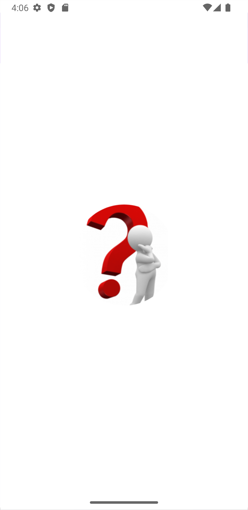
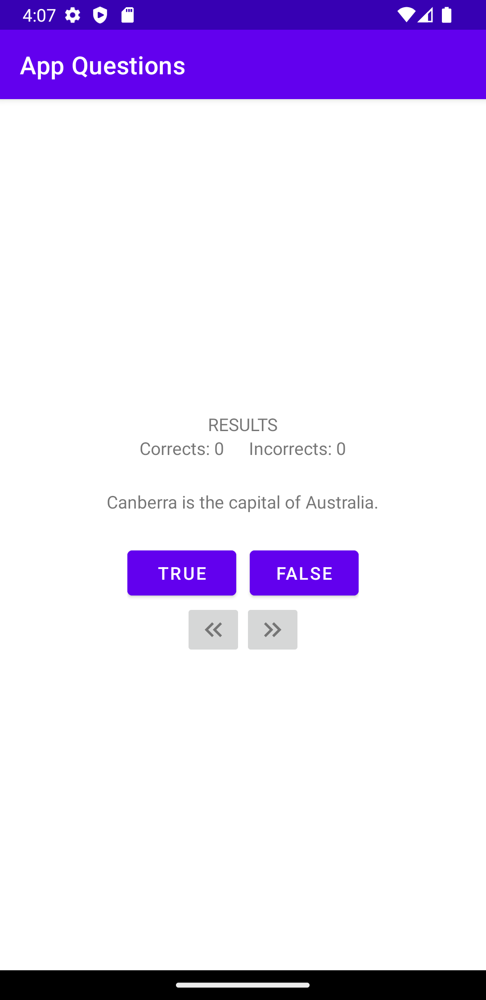
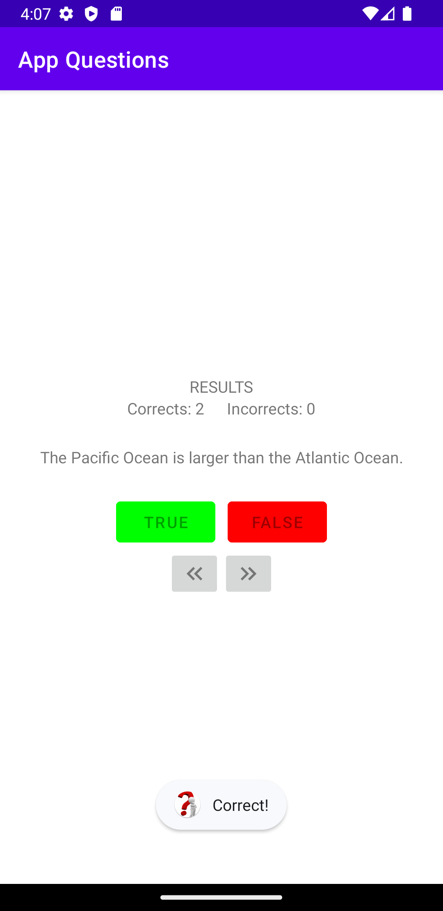
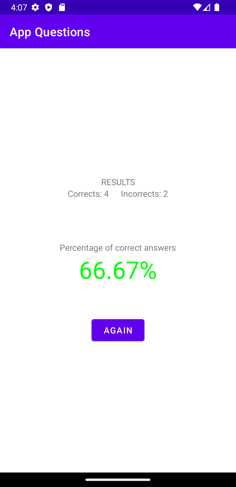
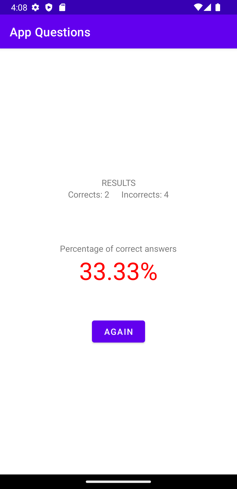
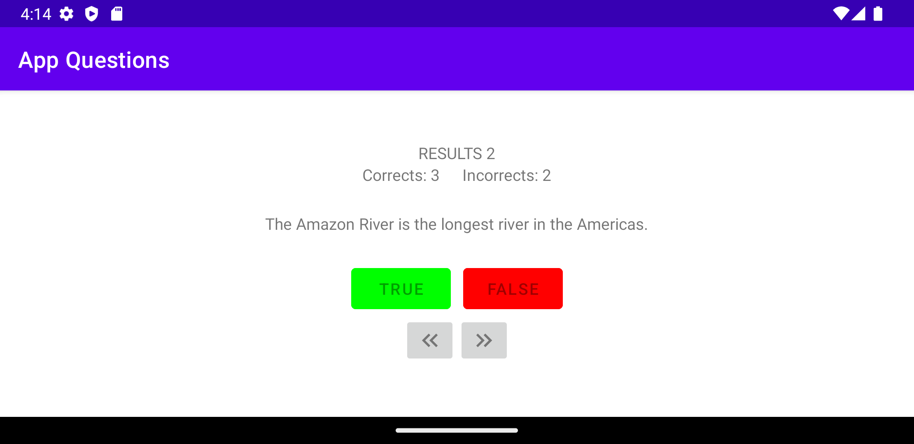
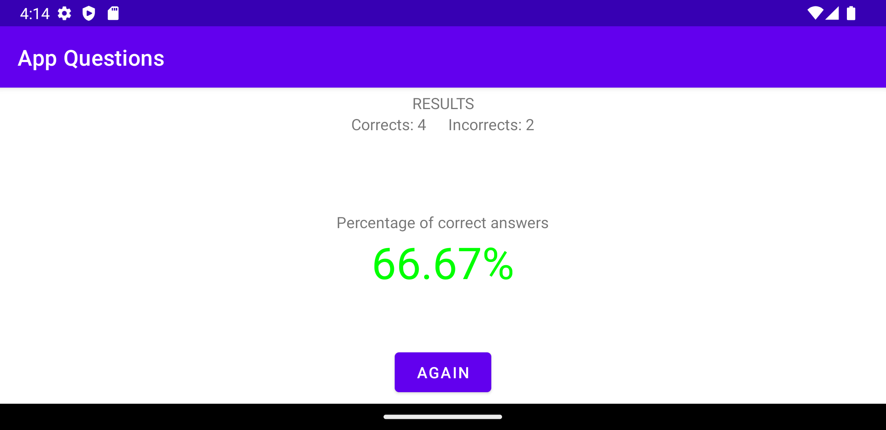

# App Questions

En este repositorio mostraré como crear una App sencilla de preguntas.

<details>

**<summary>Imágenes de la aplicación</summary>**










</details>


## Funcionamiento general (De cara al usuario)

- El icono de la aplicación será diferente al predeterminado de Android Studio

- Cuando entres a la aplicación empezará una ronda de preguntas que podrás responder con "True" o "False"-.

- También tendrá un contador de respuestas correctas y respuestas incorrectas.

- Podrás desplazarte entre las preguntas mediante unas flechas hacia adelante o hacia atrás.

- Si respondes una pregunta, no podrás editar tu respuesta.

- Cuando respondas todas las preguntas se creará otra Actividad con el resultado de preguntas correctas obtenidas.

- Tras ver tus resultados podrás volver a empezar el programa pulsando un botón.

- Si volteas el móvil en cualquier momento los datos seguirán guardados en la aplicación y podrás seguir sin ningún problema.

## Funcionamiento técnico

El programa se separará en las siguientes secciones:

- ### **Archivos Java** (Destinados al Backend en la aplicación):

    - **Actividades**

        - `MainActivity.java`: Actividad principal del programa, en esta el usuario podrá ver las preguntas, responderlas, desplazarse entre las preguntas, ver el contador de preguntas correctas y preguntas incorrectas.

        - `EndQuestionsActivity.java`: Cuando el usuario responda todas las preguntas del programa, se llamará automáticamente a esta Actividad. Se mostrará por pantalla el número de preguntas correctas, preguntas incorrectas, porcentaje de preguntas correctas y un botón para volver a empezar el programa desde 0.

    - **Clases Java**

        - `Questions.java`: En ella se guardarán las preguntas del programa con su respuesta correcta y las respuestas del usuario.

- ### **Archivos XML** (Destinados al Frontend de la aplicación):

    - **`activity_main.xml`** (Vertical y horizontal)

        - Utilizando etiquetas `<LinearLayout>` se mostrará al usuario la frase actual, 2 botones para responder `True` o `False`, 2 botones para saltar a la siguiente frase o a la anterior frase. También se mostrará un contador de preguntas correctas y preguntas incorrectas.

    - **`activity_end_questions.xml`** (Vertical y horizontal)

        - Utilizando etiquetas `<LinearLayout>` se mostrará al usuario un contador de preguntas correctas y preguntas incorrectas, un porcentaje de preguntas acertadas y un botón para volver a empezar el programa.

## **Código**

<details>

**<summary>Questions.java</summary>**

```java
package com.example.appquestions;

public class Questions {
    private int textResId;
    private Boolean answer;
    private Boolean response;

    public Questions(int textResId, Boolean answer) {
        this.textResId = textResId;
        this.answer = answer;
    }

    public void setResponse(Boolean response) {
        this.response = response;
    }

    public Boolean getResponse() {
        return this.response;
    }

    public int getTextResId() {
        return this.textResId;
    }

    public Boolean getAnswer() {
        return this.answer;
    }
}
```

</details>

<details>

**<summary>MainActivity.java</summary>**

```java
package com.example.appquestions;

import androidx.appcompat.app.AppCompatActivity;


import android.content.Intent;
import android.os.Bundle;
import android.widget.Button;
import android.widget.ImageButton;
import android.widget.TextView;
import android.widget.Toast;

import java.util.ArrayList;
import java.util.Arrays;

public class MainActivity extends AppCompatActivity {

    private Button trueButton;
    private Button falseButton;
    private ImageButton nextButton;
    private ImageButton beforeButton;
    private TextView questionTextView;

    private TextView counterCorrects;
    private TextView counterIncorrects;


    private ArrayList<Questions> questionsBank = new ArrayList<Questions>(
            Arrays.asList(
                    new Questions(R.string.question_australia, true),
                    new Questions(R.string.question_oceans, true),
                    new Questions(R.string.question_mideast, false),
                    new Questions(R.string.question_africa, false),
                    new Questions(R.string.question_americas, true),
                    new Questions(R.string.question_asia, true)
            )
    );
    private int currentIndex = 0;

    @Override
    protected void onCreate(Bundle savedInstanceState) {
        super.onCreate(savedInstanceState);
        setContentView(R.layout.activity_main);


        this.trueButton = findViewById(R.id.true_button);
        this.falseButton = findViewById(R.id.false_button);
        this.nextButton = findViewById(R.id.next_button);
        this.beforeButton = findViewById(R.id.before_button);
        this.questionTextView = findViewById(R.id.question_text_view);

        this.counterCorrects = findViewById(R.id.counterCorrects);
        this.counterIncorrects = findViewById(R.id.counterIncorrects);


        if (savedInstanceState != null) {
            this.counterCorrects.setText(savedInstanceState.getString("counterCorrectsText"));
            this.counterIncorrects.setText(savedInstanceState.getString("counterIncorrectsText"));
            this.currentIndex = savedInstanceState.getInt("currentIndex");

            ArrayList<String> questionsBankResponses = savedInstanceState.getStringArrayList("questionsBankResponses");

            for (int i = 0; i < this.questionsBank.size(); i++) {
                if (questionsBankResponses.get(i).equals("null")) {
                    this.questionsBank.get(i).setResponse(null);
                } else {
                    this.questionsBank.get(i).setResponse(Boolean.getBoolean(questionsBankResponses.get(i)));

                }
            }

        }


        this.trueButton.setOnClickListener(view ->
                checkAnswer(true)
        );

        this.falseButton.setOnClickListener(view ->
                checkAnswer(false)
        );

        this.nextButton.setOnClickListener(view -> {
            this.currentIndex = (this.currentIndex + 1) % this.questionsBank.size();
            updateQuestion();
        });

        this.beforeButton.setOnClickListener(view -> {
            if (this.currentIndex == 0) {
                this.currentIndex = this.questionsBank.size();
            }
            this.currentIndex = this.currentIndex - 1;

            updateQuestion();
        });


        this.updateQuestion();

    }


    private void updateQuestion() {
        int questionTextResId = this.questionsBank.get(this.currentIndex).getTextResId();
        this.questionTextView.setText(questionTextResId);


        this.checkResponse();
    }


    public void checkResponse() {
        if (this.questionsBank.get(this.currentIndex).getResponse() == null) {
            this.trueButton.getBackground().setTint(getColor(R.color.purple_500));
            this.falseButton.getBackground().setTint(getColor(R.color.purple_500));

            this.trueButton.setEnabled(true);
            this.falseButton.setEnabled(true);

        } else if (this.questionsBank.get(this.currentIndex).getAnswer()) {
            this.trueButton.getBackground().setTint(getColor(R.color.green));
            this.falseButton.getBackground().setTint(getColor(R.color.red));

            this.trueButton.setEnabled(false);
            this.falseButton.setEnabled(false);

        } else {
            this.trueButton.getBackground().setTint(getColor(R.color.red));
            this.falseButton.getBackground().setTint(getColor(R.color.green));

            this.trueButton.setEnabled(false);
            this.falseButton.setEnabled(false);
        }


    }


    private void checkAnswer(Boolean userAnswer) {

        this.questionsBank.get(this.currentIndex).setResponse(userAnswer);

        this.checkResponse();

        this.changesForAnswer();


        if (this.allQuestionsAnswered()) {
            this.goToEndQuestionsActivity();
        }
    }


    public void changesForAnswer() {
        int messageResId = R.string.incorrect_toast;

        if (this.questionsBank.get(this.currentIndex).getResponse() == this.questionsBank.get(this.currentIndex).getAnswer()) {
            messageResId = R.string.correct_toast;
            this.counterCorrects.setText(String.valueOf(Integer.parseInt(String.valueOf(this.counterCorrects.getText())) + 1));
        } else {
            this.counterIncorrects.setText(String.valueOf(Integer.parseInt(String.valueOf(this.counterIncorrects.getText())) + 1));

        }
        Toast.makeText(this, messageResId, Toast.LENGTH_SHORT).show();

    }

    @Override
    protected void onSaveInstanceState(Bundle savedInstanceState) {
        super.onSaveInstanceState(savedInstanceState);
        savedInstanceState.putString("counterCorrectsText", (String) this.counterCorrects.getText());
        savedInstanceState.putString("counterIncorrectsText", (String) this.counterIncorrects.getText());
        savedInstanceState.putInt("currentIndex", this.currentIndex);

        ArrayList<String> questionsBankResponses = new ArrayList<String>();
        for (int i = 0; i < this.questionsBank.size(); i++) {
            questionsBankResponses.add(String.valueOf(this.questionsBank.get(i).getResponse()));
        }
        savedInstanceState.putStringArrayList("questionsBankResponses", questionsBankResponses);

    }


    public Boolean allQuestionsAnswered() {
        Boolean response = true;

        for (Questions question : this.questionsBank) {
            if (question.getResponse() == null) {
                response = false;
            }
        }

        return response;

    }

    public void goToEndQuestionsActivity() {
        Intent intent = new Intent(this, EndQuestionsActivity.class);
        intent.putExtra("counterCorrects", this.counterCorrects.getText());
        intent.putExtra("counterIncorrects", this.counterIncorrects.getText());
        intent.putExtra("percentageCorrectAnswers", this.checkPercentageCorrectAnswers());
        this.startActivity(intent);
    }


    public float checkPercentageCorrectAnswers() {
        float percentage = 0;
        for (Questions question : this.questionsBank) {
            if (question.getResponse() == question.getAnswer()) {
                percentage++;
            }
        }
        percentage = (percentage / this.questionsBank.size()) * 100;

        return percentage;
    }

}
```

</details>

<details>

**<summary>EndQuestionsActivity.java</summary>**

```java
package com.example.appquestions;

import androidx.appcompat.app.AppCompatActivity;

import android.content.Intent;
import android.os.Bundle;
import android.util.Log;
import android.widget.Button;
import android.widget.TextView;

import java.util.ArrayList;

public class EndQuestionsActivity extends AppCompatActivity {

    private TextView counterCorrects;
    private TextView counterIncorrects;
    private TextView percentageCorrectAnswers;
    private TextView percentageSign;
    private Button buttonAgain;


    @Override
    protected void onCreate(Bundle savedInstanceState) {
        super.onCreate(savedInstanceState);
        setContentView(R.layout.activity_end_questions);

        this.counterCorrects = (TextView) findViewById(R.id.counterCorrects);
        this.counterIncorrects = (TextView) findViewById(R.id.counterIncorrects);
        this.percentageCorrectAnswers = (TextView) findViewById(R.id.percentageCorrectAnswers);
        this.percentageSign = (TextView) findViewById(R.id.percentageSign);
        this.buttonAgain = (Button) findViewById(R.id.buttonAgain);


        if (savedInstanceState != null) {
            this.counterCorrects.setText(savedInstanceState.getString("counterCorrectsText"));
            this.counterIncorrects.setText(savedInstanceState.getString("counterIncorrectsText"));
            this.counterIncorrects.setText(savedInstanceState.getString("percentageCorrectAnswers"));

        }


        Bundle extras = getIntent().getExtras();
        if (extras != null) {
            this.counterCorrects.setText(extras.getString("counterCorrects"));
            this.counterIncorrects.setText(extras.getString("counterIncorrects"));
            this.percentageCorrectAnswers.setText(String.format("%.2f", (extras.getFloat("percentageCorrectAnswers"))));
        }


        if (Float.parseFloat((String) this.percentageCorrectAnswers.getText()) >= 50) {
            this.percentageCorrectAnswers.setTextColor(getColor(R.color.green));
            this.percentageSign.setTextColor(getColor(R.color.green));

        } else {
            this.percentageCorrectAnswers.setTextColor(getColor(R.color.red));
            this.percentageSign.setTextColor(getColor(R.color.red));
        }


        this.buttonAgain.setOnClickListener(view -> {
            Intent intent = new Intent(this, MainActivity.class);
            this.startActivity(intent);
        });
    }


    @Override
    protected void onSaveInstanceState(Bundle savedInstanceState) {
        super.onSaveInstanceState(savedInstanceState);
        savedInstanceState.putString("counterCorrectsText", (String) this.counterCorrects.getText());
        savedInstanceState.putString("counterIncorrectsText", (String) this.counterIncorrects.getText());
        savedInstanceState.putString("percentageCorrectAnswers", (String) this.percentageCorrectAnswers.getText());
    }
}
```

</details>


<details>

**<summary>activity_main.xml</summary>**

```xml
<?xml version="1.0" encoding="utf-8"?>
<LinearLayout xmlns:android="http://schemas.android.com/apk/res/android"
    xmlns:tools="http://schemas.android.com/tools"
    android:layout_width="match_parent"
    android:layout_height="match_parent"
    android:gravity="center"
    android:orientation="vertical">

    <LinearLayout
        android:layout_width="wrap_content"
        android:layout_height="wrap_content"
        android:orientation="vertical">

        <TextView
            android:layout_width="match_parent"
            android:layout_height="match_parent"
            android:gravity="center"
            android:text="RESULTS" />

        <LinearLayout
            android:layout_width="wrap_content"
            android:layout_height="wrap_content"
            android:orientation="horizontal">

            <TextView
                android:layout_width="wrap_content"
                android:layout_height="wrap_content"
                android:text="Corrects: " />

            <TextView
                android:id="@+id/counterCorrects"
                android:layout_width="match_parent"
                android:layout_height="match_parent"
                android:layout_marginEnd="20sp"
                android:text="0" />

            <TextView
                android:layout_width="wrap_content"
                android:layout_height="wrap_content"
                android:text="Incorrects: " />

            <TextView
                android:id="@+id/counterIncorrects"
                android:layout_width="match_parent"
                android:layout_height="match_parent"
                android:text="0" />


        </LinearLayout>

    </LinearLayout>

    <TextView
        android:id="@+id/question_text_view"
        android:layout_width="wrap_content"
        android:layout_height="wrap_content"
        android:gravity="center"
        android:padding="24dp"
        tools:text="@string/question_australia" />

    <LinearLayout
        android:layout_width="wrap_content"
        android:layout_height="wrap_content"
        android:orientation="horizontal">


        <Button
            android:id="@+id/true_button"
            android:layout_width="wrap_content"
            android:layout_height="wrap_content"
            android:layout_marginEnd="30px"
            android:text="@string/true_button" />

        <Button
            android:id="@+id/false_button"
            android:layout_width="wrap_content"
            android:layout_height="wrap_content"
            android:text="@string/false_button" />

    </LinearLayout>


    <LinearLayout
        android:layout_width="wrap_content"
        android:layout_height="wrap_content"
        android:orientation="horizontal">

        <ImageButton
            android:id="@+id/before_button"
            android:layout_width="wrap_content"
            android:layout_height="wrap_content"
            android:src="@drawable/arrow_left" />

        <ImageButton
            android:id="@+id/next_button"
            android:layout_width="wrap_content"
            android:layout_height="wrap_content"
            android:src="@drawable/arrow_right" />

    </LinearLayout>
</LinearLayout>
```

</details>

<details>

**<summary>activity_end_questions.xml</summary>**

```xml
<?xml version="1.0" encoding="utf-8"?>
<LinearLayout xmlns:android="http://schemas.android.com/apk/res/android"
    xmlns:tools="http://schemas.android.com/tools"
    android:layout_width="match_parent"
    android:layout_height="match_parent"
    android:gravity="center"
    android:orientation="vertical">

    <LinearLayout
        android:layout_width="match_parent"
        android:layout_height="wrap_content"
        android:orientation="vertical">

        <TextView
            android:layout_width="match_parent"
            android:layout_height="wrap_content"
            android:gravity="center"
            android:text="RESULTS" />

        <LinearLayout
            android:layout_width="match_parent"
            android:layout_height="wrap_content"
            android:gravity="center"
            android:orientation="horizontal">

            <TextView
                android:layout_width="wrap_content"
                android:layout_height="wrap_content"

                android:text="Corrects: " />

            <TextView
                android:id="@+id/counterCorrects"
                android:layout_width="wrap_content"
                android:layout_height="wrap_content"
                android:layout_marginEnd="20sp"
                android:text="0" />

            <TextView
                android:layout_width="wrap_content"
                android:layout_height="wrap_content"
                android:text="Incorrects: " />

            <TextView
                android:id="@+id/counterIncorrects"
                android:layout_width="wrap_content"
                android:layout_height="wrap_content"
                android:text="0" />


        </LinearLayout>

        <LinearLayout
            android:layout_width="match_parent"
            android:layout_height="wrap_content"
            android:layout_marginTop="70sp"
            android:gravity="center"
            android:orientation="vertical">

            <TextView
                android:layout_width="wrap_content"
                android:layout_height="wrap_content"
                android:text="Percentage of correct answers" />

            <LinearLayout
                android:layout_width="wrap_content"
                android:layout_height="wrap_content"
                android:orientation="horizontal">

                <TextView
                    android:id="@+id/percentageCorrectAnswers"
                    android:layout_width="wrap_content"
                    android:layout_height="wrap_content"
                    android:textSize="40sp" />

                <TextView
                    android:id="@+id/percentageSign"
                    android:layout_width="wrap_content"
                    android:layout_height="wrap_content"
                    android:text="%"
                    android:textSize="40sp" />
            </LinearLayout>


        </LinearLayout>

    </LinearLayout>

    <Button
        android:id="@+id/buttonAgain"
        android:layout_width="wrap_content"
        android:layout_height="wrap_content"
        android:layout_marginTop="50sp"
        android:text="Again" />


</LinearLayout>
```

</details>
